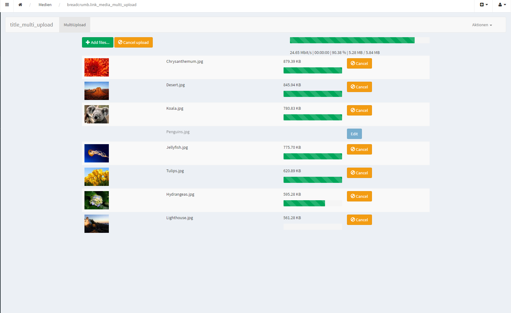

Enable Multi Upload
===================

The Multi Upload provides a way to create multiple media elements at once.

To enable this feature your provider must implement the ``MultiUploadInterface`` and the provider template ``multi_upload_input`` needs to be set

.. code-block:: xml

   <service id="sonata.media.provider.image" class="%sonata.media.provider.image.class%">
      <!-- ... -->
      <call method="setTemplates">
          <argument type="collection">
              <!-- ... -->
              <argument key="multi_upload_input">SonataMediaBundle:MediaAdmin:multi_upload.html.twig</argument>
          </argument>
      </call>
   </service>

In your provider you can add fields by adding them to the ``FormMapper``

.. code-block:: php

    <?php
    public function configureMultiUpload(FormMapper $formMapper)
    {
        // ...
        $formMapper->add('binaryContent', $fileType, array('attr' => array('multiple' => true)));
        // ...
    }

You can add your custom logic to enable the MultiUpload:

.. code-block:: php

    <?php
    public function isMultiUploadEnabled()
    {
        return isset($this->templates['multi_upload_input']);
    }
