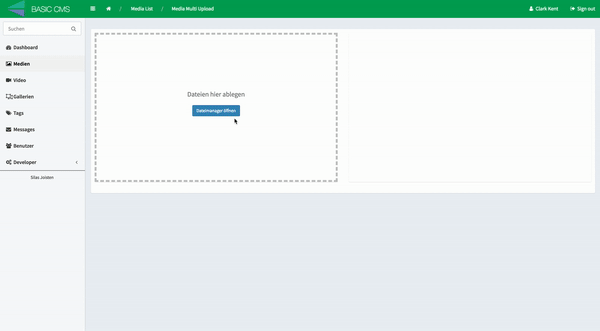

Extra
=====

The SonataMediaBundle provides some integration with externals services. For now only Pixlr is available.

Pixlr Integration
-----------------

Edit the ``sonata_media`` configuration:

.. code-block:: yaml

    # config/packages/sonata_media.yaml

    sonata_media:
        pixlr:
            enabled:  true
            secret:   theSecretHash
            referrer: Application Name

Add the pixlr routing file

.. code-block:: yaml

    # config/routes.yaml

    sonata_media_pixlr:
        resource: '@SonataMediaBundle/Resources/config/routing/pixlr.xml'
        prefix: /admin/media

And now, you can edit any pictures from the admin section.

Sonata Notification Bundle Integration
======================================

The bundle provides a specific consumer to generate thumbnails through an asynchronous task. So there no processing
time for the user after uploading a file.

In order to use this feature, you need to install the Sonata Notification Bundle and change the thumbnail configuration
for each provider:

.. code-block:: yaml

    # config/packages/sonata_media.yaml

    sonata_media:
        providers:
            image:
                thumbnail:  sonata.media.thumbnail.consumer.format
            vimeo:
                thumbnail:  sonata.media.thumbnail.consumer.format
            youtube:
                thumbnail:  sonata.media.thumbnail.consumer.format
            dailymotion:
                thumbnail:  sonata.media.thumbnail.consumer.format

Liip Imagine Bundle Integration
===============================

The bundle provides a support for LiipImagineBundle through a specific Thumbnail service. The service generates a valid
url handles by the bundle. The main advantage of LiipImagineBundle is that no thumbnail images will be stored along the
uploaded image.

The first step is to install the LiipImagineBundle, then you need to configure it by creating custom filter sets.
Each set name must be composed of CONTEXTNAME_FORMATNAME, so for the context: default and the format: small, you must
have a set named default_small.

.. code-block:: yaml

    # config/packages/liip_imagine.yaml

    liip_imagine:
        filter_sets:
            default_small:
                quality: 75
                filters:
                    thumbnail: { size: [100, 70], mode: outbound }

            default_big:
                quality: 75
                filters:
                    thumbnail: { size: [500, 70], mode: outbound }

You also need to alter the ``sonata_media`` configuration to use the ``sonata.media.thumbnail.liip_imagine`` thumbnail service

.. code-block:: yaml

    # config/packages/sonata_media.yaml

    sonata_media:
        providers:
            image:
                thumbnail:  sonata.media.thumbnail.liip_imagine
                allowed_extensions: ['jpg', 'png', 'gif', 'jpeg'] # Optional
                allowed_mime_types: ['image/pjpeg','image/jpeg','image/png','image/x-png', 'image/gif'] # Optional
            vimeo:
                thumbnail:  sonata.media.thumbnail.liip_imagine
            youtube:
                thumbnail:  sonata.media.thumbnail.liip_imagine
            dailymotion:
                thumbnail:  sonata.media.thumbnail.liip_imagine

        cdn:
            # The CDN part must point to the base root of your application with a valid htaccess to match non existant
            # file. The non existant image will be send to the SonataMediaBundle:Media:liipImagineFilter controller.
            server:
                path: 'http://mydomain.com'

.. note::

    The ``SonataMediaBundle:Media:liipImagineFilter`` is a specific controller to link the MediaBundle with LiipImagineBundle

CKEditor Integration
====================

There are two ways to integrate ``CKEditor`` with ``SonataMediaBundle``: first way is by using ``CoopTilleulsCKEditorSonataMediaBundle`` for just creating
a simple HTML CKEditor field type and another for using ``SonataFormatterBundle`` that will let you choose field editor type.

Medias in CKEditor with CoopTilleulsCKEditorSonataMediaBundle
-------------------------------------------------------------

`CoopTilleulsCKEditorSonataMediaBundle <https://github.com/coopTilleuls/CoopTilleulsCKEditorSonataMediaBundle>`_ allows to browse and upload files managed by SonataMedia directly from the UI of the `CKEditor <http://ckeditor.com/>`_ WYSIWYG editor.

To use this feature, follow `CoopTilleulsCKEditorSonataMediaBundle installation instructions <https://github.com/coopTilleuls/CoopTilleulsCKEditorSonataMediaBundle/blob/master/docs/install.md>`.

Now, just create a field with ckeditor as type and your done::

    protected function configureFormFields(FormMapper $formMapper)
    {
        $formMapper
            ->add('mytext', 'ckeditor', [
                'config' => [
                    'toolbar' => [
                        [
                            'name' => 'links',
                            'items' => ['Link', 'Unlink'],
                        ],
                        [
                            'name' => 'insert',
                            'items' => ['Image'],
                        ],
                    ],
                ],
            ]);
    }

Medias in CKEditor with SonataFormatterBundle
---------------------------------------------

`SonataFormatterBundle <https://github.com/sonata-project/SonataFormatterBundle>`_ allows to
browse and upload files managed by SonataMedia directly from the UI of the
`CKEditor <http://ckeditor.com/>`_ WYSIWYG editor too.

First of all, you have to define your ``FOSCKEditorBundle`` (already embedded in
``SonataFormatterBundle``) configurations like this:

.. code-block:: yaml

    # config/packages/fos_ck_editor.yaml

    fos_ck_editor:
        default_config: default
        configs:
            default:
                # default toolbar plus Format button
                toolbar:
                - [Bold, Italic, Underline, -, Cut, Copy, Paste,
                  PasteText, PasteFromWord, -, Undo, Redo, -,
                  NumberedList, BulletedList, -, Outdent, Indent, -,
                  Blockquote, -, Image, Link, Unlink, Table]
                - [Format, Maximize, Source]

                filebrowserBrowseRoute: admin_sonata_media_media_ckeditor_browser
                filebrowserImageBrowseRoute: admin_sonata_media_media_ckeditor_browser
                # Display images by default when clicking the image dialog browse button
                filebrowserImageBrowseRouteParameters:
                    provider: sonata.media.provider.image
                filebrowserUploadMethod: form
                filebrowserUploadRoute: admin_sonata_media_media_ckeditor_upload
                filebrowserUploadRouteParameters:
                    provider: sonata.media.provider.file
                # Upload file as image when sending a file from the image dialog
                filebrowserImageUploadRoute: admin_sonata_media_media_ckeditor_upload
                filebrowserImageUploadRouteParameters:
                    provider: sonata.media.provider.image
                    context: my-context # Optional, to upload in a custom context
                    format: my-big # Optional, media format or original size returned to editor

You can provide custom routes and a custom context to match your needs.

Second step is optional but you can also define some custom browsing and upload templates with the following configuration:

.. code-block:: yaml

    # config/packages/sonata_formatter.yaml

    sonata_formatter:
        ckeditor:
            templates:
                browser: '@SonataFormatter/Ckeditor/browser.html.twig'
                upload: '@SonataFormatter/Ckeditor/upload.html.twig'

Last step takes place in your admin class, you just have to specify the ``ckeditor_context`` parameter::

    protected function configureFormFields(FormMapper $formMapper)
    {
        $formMapper
            ->add('shortDescription', 'sonata_formatter_type', [
                'source_field' => 'rawDescription',
                'source_field_options' => ['attr' => ['class' => 'span10', 'rows' => 20]],
                'format_field' => 'descriptionFormatter',
                'target_field' => 'description',
                'ckeditor_context' => 'default',
                'event_dispatcher' => $formMapper->getFormBuilder()->getEventDispatcher()
            ]);
    }

Afterwards you can browse and upload your medias using ``SonataMediaBundle``.

Sonata Multiupload Bundle
=========================

This bundle allows you a multiple upload of Media's. It provides JavaScript
side mimetype and file extension validation.

Read the full documentation `here <https://github.com/silasjoisten/sonata-multiupload-bundle>`_
